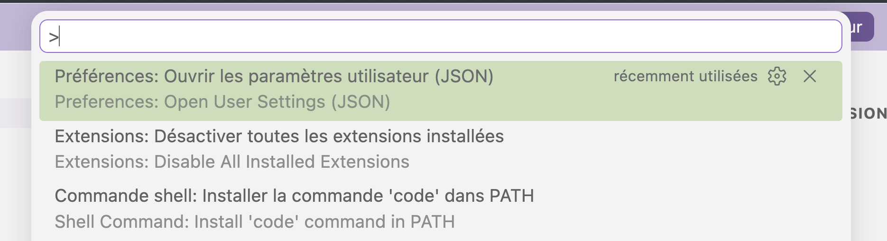
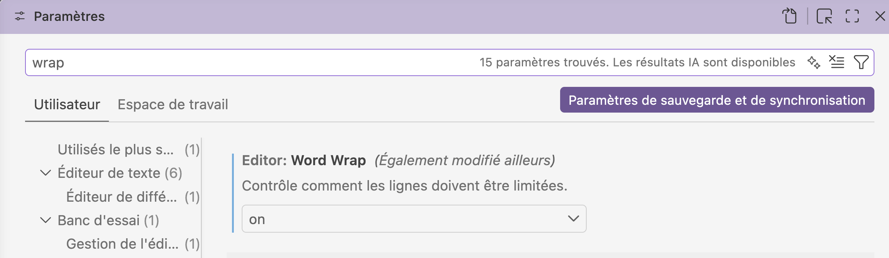

## Les Réglages utilisateur

 Il existe deux types de réglages: 
 
 - Réglages utilisateur (au niveau global)
 - Réglages du workspace (espace de travail spécifique au projet)

### Réglages utilisateur (global)

Les réglages utilisateur au niveau global se trouvent dans un fichier nommé `settings.json`.

- S'appliquent à **toutes tes instances VS Code**, quel que soit le projet ouvert
- Stockés dans ton profil système (`~/Library/Application Support/Code/User/` sur macOS)
- Idéal pour tes préférences personnelles : fonte, thème, raccourcis, comportement général

### Réglages Espace de travail

Les réglages propres à un Espace de travail (Workspace) se trouvent dans un fichier nommé `.vscode/settings.json` situé à la racine du projet.

- S'appliquent **uniquement au projet courant**
- Stockés dans le dossier du projet, donc **versionnables avec Git**
- Écrasent les réglages Utilisateur en cas de conflit
- Idéal pour les conventions d'équipe : *indentation, formateur de code, linter*

### Modifier les réglages

On peut modifier les réglages de deux façons:

1. À travers l'interface visuelle.
2. Dans le code d'un fichier JSON.

Pour l'interface visuelle: faire Code > Préférences > Paramètres


Pour modifier les Réglages Utilisateur dans settings.json : 

- Faire la commande Maj+Cmd+P qui ouvre la *Palette des commandes*.
- Saisir la commande: *Préférences: Ouvrir les paramètres utilisateur (JSON)*.
- On se retrouve avec un fichier Json qu'on peut éditer.




## Word Wrap

Par défaut, le "word wrap" n'est pas actif, les lignes longues peuvent donc dépasser la fenêtre visible.

Pour permettre à l'interface de faire des retours de ligne, il faut faire cette modification dans le `settings.json`

```
"editor.wordWrap": "on"
```

On peut aussi trouver ce réglage dans *Préférences > Paramètres* et rechercher "Word Wrap", et mettre le réglage sur "on".



## Désactiver les références à MDN

Par défaut, dans un fichier HTML, VSCode affiche des informations au survol d'un élément. Ces fenêtres modales peuvent être désactivées. 

Le réglage se trouve dans le profil utilisateur, on peut le trouver en cherchant avec le mot clé «Hover».

Les réglages en code:

```
"html.hover.references": false,
    "less.hover.references": false,
    "html.hover.documentation": false,
    "less.hover.documentation": false,
```

## Désactiver l'IA

Sous Conversation > Divers : Disable AI Features

Correspond au code suivant:
```
"chat.disableAIFeatures": true,
```