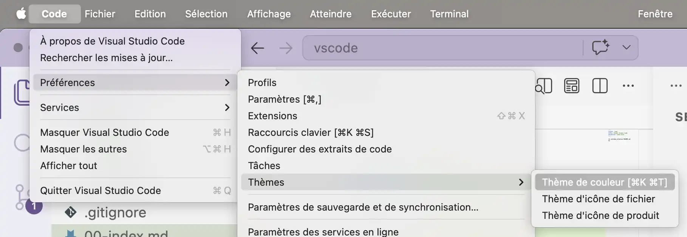
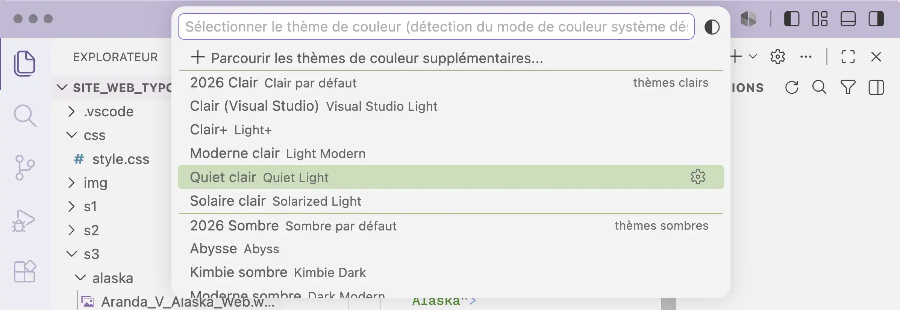
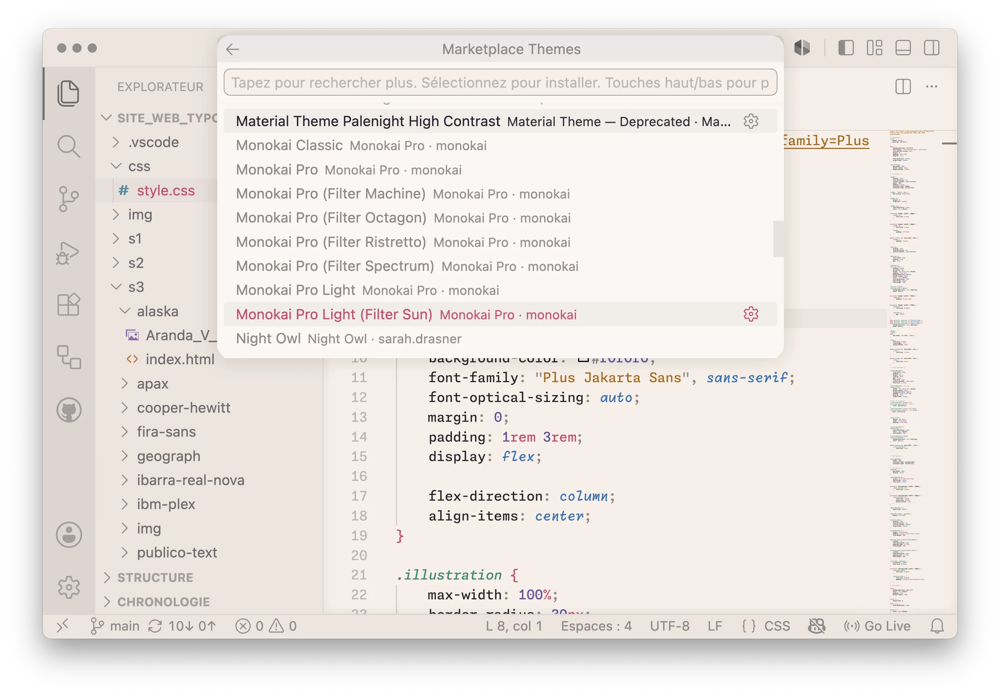
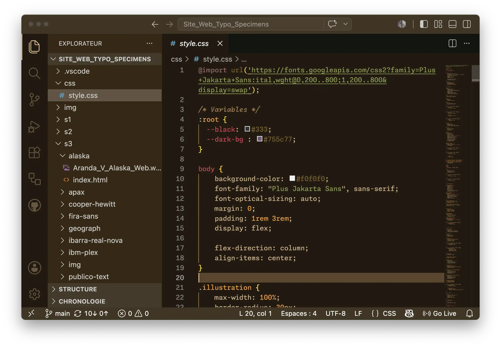
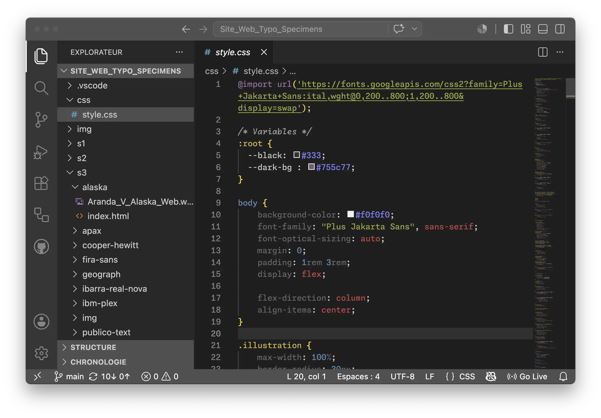
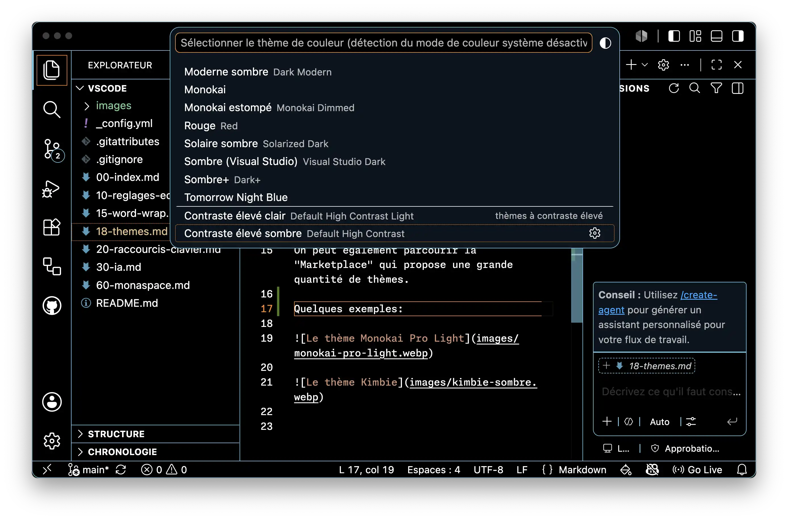

Dans VS Code, il est possible de définir un thème couleur personnalisé.

En faisant *Préférences > Thèmes > Thèmes de couleur* (Raccourci: `cmd+K cmd+T`), on accède à la liste des thèmes installés. 

On peut les parcourir et prévisualiser le résultat. Ils sont répartis en thèmes clairs, thèmes sombres, et thèmes à contraste élevé.

On peut également parcourir la "Marketplace" qui propose une grande quantité de thèmes.

Quelques exemples:

