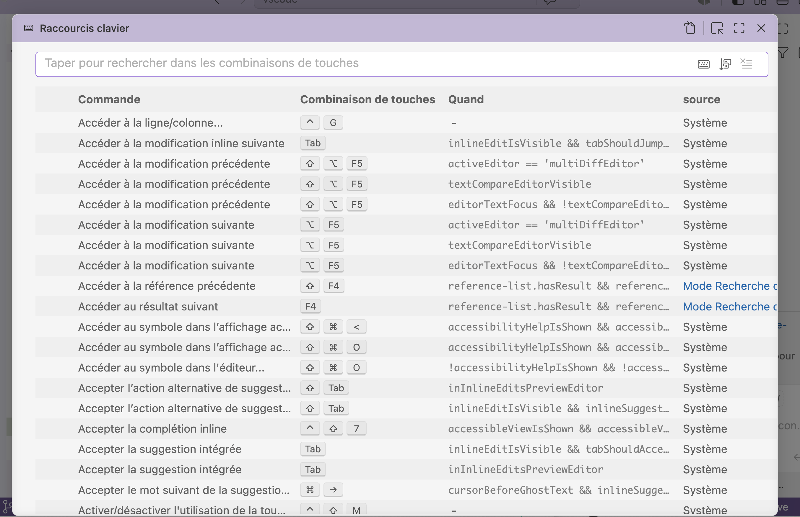

VS Code comporte un grand nombre de raccourcis clavier, qui aident à un travail rapide et fluide.

Voici quelques raccourcis spécialement utiles.

**Command Palette**  
Mac: ⇧⌘P, F1  
Windows ou Linux: Ctrl+Shift+P ou F1

**Move Lines Up or Down**  
Mac: ⌥↓ / ⌥↑  
Windows or Linux: Alt+ ↓ / Alt+ ↑

**Open Search Panel**  
Mac: ⇧⌘F  
Windows or Linux: Ctrl+Shift+F

**Toggle Comment(s)**  
Mac: ⌘/  
Windows or Linux: Ctrl+/

**Select All Occurrences**  
Mac: ⇧⌘L  
Windows or Linux: Ctrl+Shift+L

## Bon à savoir

La commande **Copier** (raccourci: cmd+C), si aucune sélection n'est active, va copier **la ligne entière** où se trouve le curseur.

## Référence des raccourcis clavier

Pour voir la liste complète des raccourcis : 

Les afficher avec *Code > Préférences > Raccourcis clavier* (cmd+K cmd+S). Cette fenêtre permet aussi de modifier des raccourcis.

### Raccourcis à deux étapes

Certains raccourcis sont composés de deux étapes. Pour "cmd+K cmd+S", il faut d'abord taper les touches "cmd+K", puis ensuite "cmd+S".

