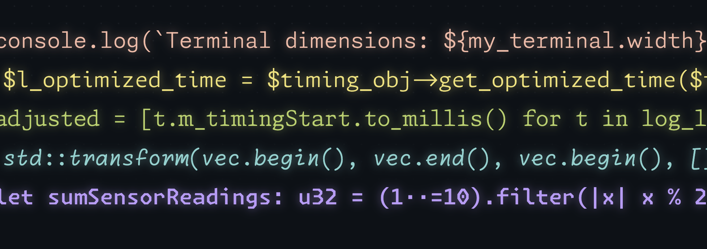
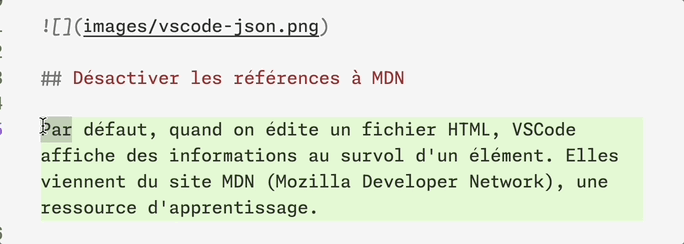

La famille de fontes typographiques [Monaspace](https://monaspace.githubnext.com/) a été développée par Github. Elle permet d'appliquer diverses optimisations à l'affichage du code. Elle possède cinq variantes ayant différentes caractéristiques.



Voici quelques réglages pour bien l'utiliser:

Dans les paramètres utilisateur (JSON):

```json
"editor.fontFamily": "'Monaspace Neon Var', Menlo, Monaco, 'Courier New', monospace",
"editor.fontSize": 12,
"editor.fontVariations": "'wght' 350",
"editor.fontLigatures": "'calt', 'liga', 'ss01', 'ss02', 'ss03', 'ss04', 'ss05', 'ss06', 'ss07', 'ss08', 'ss09', 'ss10'",
```

Ces réglages définissent la fonte, la taille, l'épaisseur, et activent des fonctionnalités telles que des ligatures.

```json
"editor.tokenColorCustomizations": {
  "textMateRules": [
    {
      "name": "Comments",
      "scope": [
        "comment",
        "comment.line",
        "comment.block",
        "punctuation.definition.comment"
      ],
      "settings": {
        "fontStyle": "italic"
      }
    }
  ]
}
```

Ce réglage va appliquer la version italique de la fonte pour les **commentaires de code**.

Cette méthode devrait aussi fonctionner avec la fonte [Cascadia Code](https://github.com/microsoft/cascadia-code). 

## Fonte différente pour les commentaires

Pour appliquer pas seulement l'italique, mais carrément une **fonte différente** pour les commentaires (p.ex. Monaspace Radon qui ressemble à l'écriture manuelle), il faut plusieurs étapes:

- Installer l'extension [Custom CSS and JS Loader](https://marketplace.visualstudio.com/items?itemName=be5invis.vscode-custom-css), car VS Code ne permet pas nativement de cibler deux familles de polices différentes par token. 
- Créer un fichier `custom.css` qui contient un code comme ceci:

```css
/* Commentaires en Monaspace Radon */
.mtk3,
.mtk7,
[class*="comment"] {
  font-family: "Monaspace Radon Var", monospace !important;
}
```

Activer les styles personnalisés via la palette de commandes :

> Enable Custom CSS and JS

Désormais VSCode donne une alerte au démarrage: "Votre installation de Code semble être endommagée. Effectuez une réinstallation." Comment résoudre cela ?

Installer l'extension *Fix VSCode Checksums Next*, puis :

- Ouvre la palette de commandes (Cmd+Shift+P / Ctrl+Shift+P)
- Lancer : > Fix Checksums: Apply
- Redémarrer complètement VS Code

Résultat: une fonte différente pour les commentaires: 



### Ressources

- Mix & Match in VS Code? - https://github.com/githubnext/monaspace/issues/6

